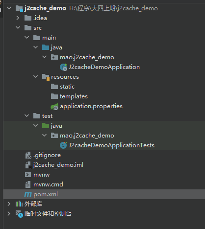
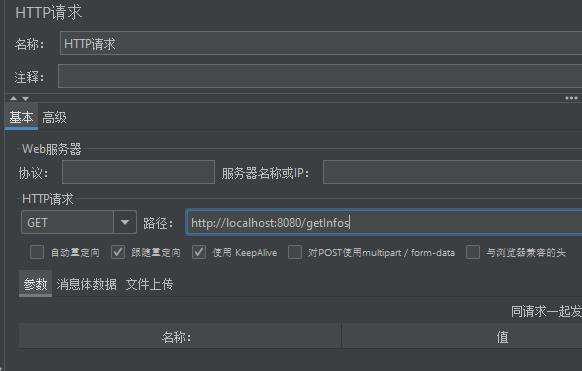
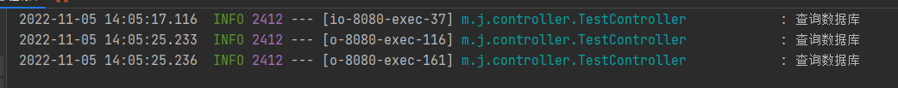

# j2cache

## 介绍

j2cache是OSChina目前正在使用的两级缓存框架。

j2cache的两级缓存结构：

- L1： 进程内缓存 caffeine/ehcache
- L2： 集中式缓存 Redis/Memcached

j2cache其实并不是在重复造轮子，而是作资源整合，即将Ehcache、Caffeine、redis、Spring Cache等进行整合。

由于大量的缓存读取会导致L2的网络成为整个系统的瓶颈，因此L1的目标是降低对L2的读取次数。该缓存框架主要用于集群环境中。单机也可使用，用于避免应用重启导致的ehcache缓存数据丢失。

j2cache从1.3.0版本开始支持JGroups和Redis Pub/Sub两种方式进行缓存事件的通知。

数据读取顺序 -> L1 -> L2 -> DB

使用j2cache需要导入的maven坐标：

```xml
<dependency>
    <groupId>net.oschina.j2cache</groupId>
    <artifactId>j2cache-spring-boot2-starter</artifactId>
    <version>2.8.0-release</version>
</dependency>
<dependency>
    <groupId>net.oschina.j2cache</groupId>
    <artifactId>j2cache-core</artifactId>
    <version>2.8.0-release</version>
    <exclusions>
        <exclusion>
            <groupId>org.slf4j</groupId>
            <artifactId>slf4j-simple</artifactId>
        </exclusion>
        <exclusion>
            <groupId>org.slf4j</groupId>
            <artifactId>slf4j-api</artifactId>
        </exclusion>
    </exclusions>
</dependency>
```


## j2cache入门案例


### 第一步：创建工程j2cache_demo





### 第二步：修改pom文件


```xml
<?xml version="1.0" encoding="UTF-8"?>
<project xmlns="http://maven.apache.org/POM/4.0.0" xmlns:xsi="http://www.w3.org/2001/XMLSchema-instance"
         xsi:schemaLocation="http://maven.apache.org/POM/4.0.0 https://maven.apache.org/xsd/maven-4.0.0.xsd">
    <modelVersion>4.0.0</modelVersion>
    <parent>
        <groupId>org.springframework.boot</groupId>
        <artifactId>spring-boot-starter-parent</artifactId>
        <version>2.7.1</version>
        <relativePath/> <!-- lookup parent from repository -->
    </parent>
    <groupId>mao</groupId>
    <artifactId>j2cache_demo</artifactId>
    <version>0.0.1-SNAPSHOT</version>
    <name>j2cache_demo</name>
    <description>j2cache_demo</description>
    <properties>
        <java.version>8</java.version>
    </properties>
    <dependencies>

        <dependency>
            <groupId>org.springframework.boot</groupId>
            <artifactId>spring-boot-starter-web</artifactId>
        </dependency>

        <dependency>
            <groupId>org.springframework.boot</groupId>
            <artifactId>spring-boot-starter-test</artifactId>
            <scope>test</scope>
        </dependency>

        <dependency>
            <groupId>net.oschina.j2cache</groupId>
            <artifactId>j2cache-spring-boot2-starter</artifactId>
            <version>2.8.0-release</version>
        </dependency>
        <dependency>
            <groupId>net.oschina.j2cache</groupId>
            <artifactId>j2cache-core</artifactId>
            <version>2.8.0-release</version>
            <exclusions>
                <exclusion>
                    <groupId>org.slf4j</groupId>
                    <artifactId>slf4j-simple</artifactId>
                </exclusion>
                <exclusion>
                    <groupId>org.slf4j</groupId>
                    <artifactId>slf4j-api</artifactId>
                </exclusion>
            </exclusions>
        </dependency>

    </dependencies>

    <build>
        <plugins>
            <plugin>
                <groupId>org.springframework.boot</groupId>
                <artifactId>spring-boot-maven-plugin</artifactId>
            </plugin>
        </plugins>
    </build>

</project>
```


### 第三步：修改application.yml文件


```yaml
spring:
  cache:
    type: GENERIC
  redis:
    host: 127.0.0.1
    password: 123456
    port: 6379
    database: 0

j2cache:
  #  config-location: /j2cache.properties
  open-spring-cache: true
  cache-clean-mode: passive
  allow-null-values: true
  redis-client: lettuce #指定redis客户端使用lettuce，也可以使用Jedis
  l2-cache-open: true #开启二级缓存
  broadcast: net.oschina.j2cache.cache.support.redis.SpringRedisPubSubPolicy
  #  broadcast: jgroups
  L1: #指定一级缓存提供者为caffeine
    provider_class: caffeine
  L2: #指定二级缓存提供者为redis
    provider_class: net.oschina.j2cache.cache.support.redis.SpringRedisProvider
    config_section: lettuce
  sync_ttl_to_redis: true
  default_cache_null_object: false
  serialization: fst
caffeine:
  properties: /caffeine.properties   # 这个配置文件需要放在项目中
lettuce:
  mode: single
  namespace:
  storage: generic
  channel: j2cache
  scheme: redis
  hosts: 127.0.0.1:6379
  password: 123456
  database: 0
  sentinelMasterId:
  maxTotal: 100
  maxIdle: 10
  minIdle: 10
  timeout: 10000
```


### 第四步：启动Redis


```sh
C:\Users\mao>redis-cli
127.0.0.1:6379> auth 123456
OK
127.0.0.1:6379> ping
PONG
127.0.0.1:6379>
```


### 第五步：创建/resources/caffeine.properties文件


```properties
#########################################
# Caffeine configuration
# [name] = size, xxxx[s|m|h|d]
#########################################
default=2000, 2h
rx=50, 2h
```


### 第六步：编写TestController


```java
package mao.j2cache_demo.controller;

import net.oschina.j2cache.CacheChannel;
import net.oschina.j2cache.CacheObject;
import org.springframework.beans.factory.annotation.Autowired;
import org.springframework.web.bind.annotation.GetMapping;
import org.springframework.web.bind.annotation.RestController;

import java.util.ArrayList;
import java.util.List;

/**
 * Project name(项目名称)：j2cache_demo
 * Package(包名): mao.j2cache_demo.controller
 * Class(类名): TestController
 * Author(作者）: mao
 * Author QQ：1296193245
 * GitHub：https://github.com/maomao124/
 * Date(创建日期)： 2022/11/5
 * Time(创建时间)： 13:22
 * Version(版本): 1.0
 * Description(描述)： 无
 */

@RestController
public class TestController
{

    @Autowired
    private CacheChannel cacheChannel;

    private final String key = "myKey";
    private final String region = "rx";


    @GetMapping("/getInfos")
    public List<String> getInfos()
    {
        CacheObject cacheObject = cacheChannel.get(region, key);
        if (cacheObject.getValue() == null)
        {
            //缓存中没有找到，查询数据库获得
            List<String> data = new ArrayList<>();
            data.add("info1");
            data.add("info2");
            //放入缓存
            cacheChannel.set(region, key, data);
            return data;
        }
        return (List<String>) cacheObject.getValue();
    }

    /**
     * 清理指定缓存
     *
     * @return {@link String}
     */
    @GetMapping("/evict")
    public String evict()
    {
        cacheChannel.evict(region, key);
        return "evict success";
    }

    /**
     * 检测存在那级缓存
     *
     * @return {@link String}
     */
    @GetMapping("/check")
    public String check()
    {
        int check = cacheChannel.check(region, key);
        return "level:" + check;
    }

    /**
     * 检测缓存数据是否存在
     *
     * @return {@link String}
     */
    @GetMapping("/exists")
    public String exists()
    {
        boolean exists = cacheChannel.exists(region, key);
        return "exists:" + exists;
    }

    /**
     * 清理指定区域的缓存
     *
     * @return {@link String}
     */
    @GetMapping("/clear")
    public String clear()
    {
        cacheChannel.clear(region);
        return "clear success";
    }
}
```


### 第七步：启动程序


```sh

  .   ____          _            __ _ _
 /\\ / ___'_ __ _ _(_)_ __  __ _ \ \ \ \
( ( )\___ | '_ | '_| | '_ \/ _` | \ \ \ \
 \\/  ___)| |_)| | | | | || (_| |  ) ) ) )
  '  |____| .__|_| |_|_| |_\__, | / / / /
 =========|_|==============|___/=/_/_/_/
 :: Spring Boot ::                (v2.7.1)

2022-11-05 13:43:46.628  INFO 10704 --- [           main] mao.j2cache_demo.J2cacheDemoApplication  : Starting J2cacheDemoApplication using Java 1.8.0_332 on mao with PID 10704 (H:\程序\大四上期\j2cache_demo\target\classes started by mao in H:\程序\大四上期\j2cache_demo)
2022-11-05 13:43:46.630  INFO 10704 --- [           main] mao.j2cache_demo.J2cacheDemoApplication  : No active profile set, falling back to 1 default profile: "default"
2022-11-05 13:43:46.895  INFO 10704 --- [           main] o.s.c.a.ConfigurationClassParser         : Properties location [${j2cache.config-location}] not resolvable: Could not resolve placeholder 'j2cache.config-location' in value "${j2cache.config-location}"
2022-11-05 13:43:47.087  INFO 10704 --- [           main] .s.d.r.c.RepositoryConfigurationDelegate : Multiple Spring Data modules found, entering strict repository configuration mode
2022-11-05 13:43:47.089  INFO 10704 --- [           main] .s.d.r.c.RepositoryConfigurationDelegate : Bootstrapping Spring Data Redis repositories in DEFAULT mode.
2022-11-05 13:43:47.106  INFO 10704 --- [           main] .s.d.r.c.RepositoryConfigurationDelegate : Finished Spring Data repository scanning in 5 ms. Found 0 Redis repository interfaces.
2022-11-05 13:43:47.462  INFO 10704 --- [           main] o.s.b.w.embedded.tomcat.TomcatWebServer  : Tomcat initialized with port(s): 8080 (http)
2022-11-05 13:43:47.469  INFO 10704 --- [           main] o.apache.catalina.core.StandardService   : Starting service [Tomcat]
2022-11-05 13:43:47.469  INFO 10704 --- [           main] org.apache.catalina.core.StandardEngine  : Starting Servlet engine: [Apache Tomcat/9.0.64]
2022-11-05 13:43:47.580  INFO 10704 --- [           main] o.a.c.c.C.[Tomcat].[localhost].[/]       : Initializing Spring embedded WebApplicationContext
2022-11-05 13:43:47.580  INFO 10704 --- [           main] w.s.c.ServletWebServerApplicationContext : Root WebApplicationContext: initialization completed in 918 ms
2022-11-05 13:43:47.671  INFO 10704 --- [           main] n.o.j2cache.util.SerializationUtils      : Using Serializer -> [fst:net.oschina.j2cache.util.FSTSerializer]
2022-11-05 13:43:47.674  INFO 10704 --- [           main] net.oschina.j2cache.CacheProviderHolder  : Using L1 CacheProvider : net.oschina.j2cache.caffeine.CaffeineProvider
2022-11-05 13:43:47.864  INFO 10704 --- [           main] net.oschina.j2cache.CacheProviderHolder  : Using L2 CacheProvider : net.oschina.j2cache.cache.support.redis.SpringRedisProvider
2022-11-05 13:43:47.873  INFO 10704 --- [           main] net.oschina.j2cache.J2CacheBuilder       : Using cluster policy : net.oschina.j2cache.cache.support.redis.SpringRedisPubSubPolicy
2022-11-05 13:43:48.231  INFO 10704 --- [           main] o.s.b.w.embedded.tomcat.TomcatWebServer  : Tomcat started on port(s): 8080 (http) with context path ''
2022-11-05 13:43:48.878  INFO 10704 --- [           main] mao.j2cache_demo.J2cacheDemoApplication  : Started J2cacheDemoApplication in 2.561 seconds (JVM running for 3.309)
```


### 第八步：访问


http://localhost:8080/getInfos


http://localhost:8080/evict


http://localhost:8080/getInfos

http://localhost:8080/check


http://localhost:8080/exists


http://localhost:8080/clear


## 无法启动解决


启动报以下错误：

```sh
Error starting ApplicationContext. To display the conditions report re-run your application with 'debug' enabled.
2022-11-05 13:32:38.028 ERROR 8520 --- [           main] o.s.boot.SpringApplication               : Application run failed

org.springframework.beans.factory.UnsatisfiedDependencyException: Error creating bean with name 'testController': Unsatisfied dependency expressed through field 'cacheChannel'; nested exception is org.springframework.beans.factory.BeanCreationException: Error creating bean with name 'cacheChannel' defined in class path resource [net/oschina/j2cache/autoconfigure/J2CacheAutoConfiguration.class]: Bean instantiation via factory method failed; nested exception is org.springframework.beans.BeanInstantiationException: Failed to instantiate [net.oschina.j2cache.CacheChannel]: Factory method 'cacheChannel' threw exception; nested exception is java.lang.reflect.InaccessibleObjectException: Unable to make field private final java.math.BigInteger java.math.BigDecimal.intVal accessible: module java.base does not "opens java.math" to unnamed module @76908cc0
	at org.springframework.beans.factory.annotation.AutowiredAnnotationBeanPostProcessor$AutowiredFieldElement.resolveFieldValue(AutowiredAnnotationBeanPostProcessor.java:659) ~[spring-beans-5.3.21.jar:5.3.21]
	at org.springframework.beans.factory.annotation.AutowiredAnnotationBeanPostProcessor$AutowiredFieldElement.inject(AutowiredAnnotationBeanPostProcessor.java:639) ~[spring-beans-5.3.21.jar:5.3.21]
	at org.springframework.beans.factory.annotation.InjectionMetadata.inject(InjectionMetadata.java:119) ~[spring-beans-5.3.21.jar:5.3.21]
	at org.springframework.beans.factory.annotation.AutowiredAnnotationBeanPostProcessor.postProcessProperties(AutowiredAnnotationBeanPostProcessor.java:399) ~[spring-beans-5.3.21.jar:5.3.21]
	at org.springframework.beans.factory.support.AbstractAutowireCapableBeanFactory.populateBean(AbstractAutowireCapableBeanFactory.java:1431) ~[spring-beans-5.3.21.jar:5.3.21]
	at org.springframework.beans.factory.support.AbstractAutowireCapableBeanFactory.doCreateBean(AbstractAutowireCapableBeanFactory.java:619) ~[spring-beans-5.3.21.jar:5.3.21]
	at org.springframework.beans.factory.support.AbstractAutowireCapableBeanFactory.createBean(AbstractAutowireCapableBeanFactory.java:542) ~[spring-beans-5.3.21.jar:5.3.21]
	at org.springframework.beans.factory.support.AbstractBeanFactory.lambda$doGetBean$0(AbstractBeanFactory.java:335) ~[spring-beans-5.3.21.jar:5.3.21]
	at org.springframework.beans.factory.support.DefaultSingletonBeanRegistry.getSingleton(DefaultSingletonBeanRegistry.java:234) ~[spring-beans-5.3.21.jar:5.3.21]
	at org.springframework.beans.factory.support.AbstractBeanFactory.doGetBean(AbstractBeanFactory.java:333) ~[spring-beans-5.3.21.jar:5.3.21]
	at org.springframework.beans.factory.support.AbstractBeanFactory.getBean(AbstractBeanFactory.java:208) ~[spring-beans-5.3.21.jar:5.3.21]
	at org.springframework.beans.factory.support.DefaultListableBeanFactory.preInstantiateSingletons(DefaultListableBeanFactory.java:955) ~[spring-beans-5.3.21.jar:5.3.21]
	at org.springframework.context.support.AbstractApplicationContext.finishBeanFactoryInitialization(AbstractApplicationContext.java:918) ~[spring-context-5.3.21.jar:5.3.21]
	at org.springframework.context.support.AbstractApplicationContext.refresh(AbstractApplicationContext.java:583) ~[spring-context-5.3.21.jar:5.3.21]
	at org.springframework.boot.web.servlet.context.ServletWebServerApplicationContext.refresh(ServletWebServerApplicationContext.java:147) ~[spring-boot-2.7.1.jar:2.7.1]
	at org.springframework.boot.SpringApplication.refresh(SpringApplication.java:734) ~[spring-boot-2.7.1.jar:2.7.1]
	at org.springframework.boot.SpringApplication.refreshContext(SpringApplication.java:408) ~[spring-boot-2.7.1.jar:2.7.1]
	at org.springframework.boot.SpringApplication.run(SpringApplication.java:308) ~[spring-boot-2.7.1.jar:2.7.1]
	at org.springframework.boot.SpringApplication.run(SpringApplication.java:1306) ~[spring-boot-2.7.1.jar:2.7.1]
	at org.springframework.boot.SpringApplication.run(SpringApplication.java:1295) ~[spring-boot-2.7.1.jar:2.7.1]
	at mao.j2cache_demo.J2cacheDemoApplication.main(J2cacheDemoApplication.java:12) ~[classes/:na]
Caused by: org.springframework.beans.factory.BeanCreationException: Error creating bean with name 'cacheChannel' defined in class path resource [net/oschina/j2cache/autoconfigure/J2CacheAutoConfiguration.class]: Bean instantiation via factory method failed; nested exception is org.springframework.beans.BeanInstantiationException: Failed to instantiate [net.oschina.j2cache.CacheChannel]: Factory method 'cacheChannel' threw exception; nested exception is java.lang.reflect.InaccessibleObjectException: Unable to make field private final java.math.BigInteger java.math.BigDecimal.intVal accessible: module java.base does not "opens java.math" to unnamed module @76908cc0
	at org.springframework.beans.factory.support.ConstructorResolver.instantiate(ConstructorResolver.java:658) ~[spring-beans-5.3.21.jar:5.3.21]
	at org.springframework.beans.factory.support.ConstructorResolver.instantiateUsingFactoryMethod(ConstructorResolver.java:638) ~[spring-beans-5.3.21.jar:5.3.21]
	at org.springframework.beans.factory.support.AbstractAutowireCapableBeanFactory.instantiateUsingFactoryMethod(AbstractAutowireCapableBeanFactory.java:1352) ~[spring-beans-5.3.21.jar:5.3.21]
	at org.springframework.beans.factory.support.AbstractAutowireCapableBeanFactory.createBeanInstance(AbstractAutowireCapableBeanFactory.java:1195) ~[spring-beans-5.3.21.jar:5.3.21]
	at org.springframework.beans.factory.support.AbstractAutowireCapableBeanFactory.doCreateBean(AbstractAutowireCapableBeanFactory.java:582) ~[spring-beans-5.3.21.jar:5.3.21]
	at org.springframework.beans.factory.support.AbstractAutowireCapableBeanFactory.createBean(AbstractAutowireCapableBeanFactory.java:542) ~[spring-beans-5.3.21.jar:5.3.21]
	at org.springframework.beans.factory.support.AbstractBeanFactory.lambda$doGetBean$0(AbstractBeanFactory.java:335) ~[spring-beans-5.3.21.jar:5.3.21]
	at org.springframework.beans.factory.support.DefaultSingletonBeanRegistry.getSingleton(DefaultSingletonBeanRegistry.java:234) ~[spring-beans-5.3.21.jar:5.3.21]
	at org.springframework.beans.factory.support.AbstractBeanFactory.doGetBean(AbstractBeanFactory.java:333) ~[spring-beans-5.3.21.jar:5.3.21]
	at org.springframework.beans.factory.support.AbstractBeanFactory.getBean(AbstractBeanFactory.java:208) ~[spring-beans-5.3.21.jar:5.3.21]
	at org.springframework.beans.factory.config.DependencyDescriptor.resolveCandidate(DependencyDescriptor.java:276) ~[spring-beans-5.3.21.jar:5.3.21]
	at org.springframework.beans.factory.support.DefaultListableBeanFactory.doResolveDependency(DefaultListableBeanFactory.java:1391) ~[spring-beans-5.3.21.jar:5.3.21]
	at org.springframework.beans.factory.support.DefaultListableBeanFactory.resolveDependency(DefaultListableBeanFactory.java:1311) ~[spring-beans-5.3.21.jar:5.3.21]
	at org.springframework.beans.factory.annotation.AutowiredAnnotationBeanPostProcessor$AutowiredFieldElement.resolveFieldValue(AutowiredAnnotationBeanPostProcessor.java:656) ~[spring-beans-5.3.21.jar:5.3.21]
	... 20 common frames omitted
Caused by: org.springframework.beans.BeanInstantiationException: Failed to instantiate [net.oschina.j2cache.CacheChannel]: Factory method 'cacheChannel' threw exception; nested exception is java.lang.reflect.InaccessibleObjectException: Unable to make field private final java.math.BigInteger java.math.BigDecimal.intVal accessible: module java.base does not "opens java.math" to unnamed module @76908cc0
	at org.springframework.beans.factory.support.SimpleInstantiationStrategy.instantiate(SimpleInstantiationStrategy.java:185) ~[spring-beans-5.3.21.jar:5.3.21]
	at org.springframework.beans.factory.support.ConstructorResolver.instantiate(ConstructorResolver.java:653) ~[spring-beans-5.3.21.jar:5.3.21]
	... 33 common frames omitted
Caused by: java.lang.reflect.InaccessibleObjectException: Unable to make field private final java.math.BigInteger java.math.BigDecimal.intVal accessible: module java.base does not "opens java.math" to unnamed module @76908cc0
	at java.base/java.lang.reflect.AccessibleObject.checkCanSetAccessible(AccessibleObject.java:357) ~[na:na]
	at java.base/java.lang.reflect.AccessibleObject.checkCanSetAccessible(AccessibleObject.java:297) ~[na:na]
	at java.base/java.lang.reflect.Field.checkCanSetAccessible(Field.java:177) ~[na:na]
	at java.base/java.lang.reflect.Field.setAccessible(Field.java:171) ~[na:na]
	at org.nustaq.serialization.FSTClazzInfo.createFieldInfo(FSTClazzInfo.java:512) ~[fst-2.57.jar:na]
	at org.nustaq.serialization.FSTClazzInfo.createFields(FSTClazzInfo.java:368) ~[fst-2.57.jar:na]
	at org.nustaq.serialization.FSTClazzInfo.<init>(FSTClazzInfo.java:129) ~[fst-2.57.jar:na]
	at org.nustaq.serialization.FSTClazzInfoRegistry.getCLInfo(FSTClazzInfoRegistry.java:129) ~[fst-2.57.jar:na]
	at org.nustaq.serialization.FSTClazzNameRegistry.addClassMapping(FSTClazzNameRegistry.java:98) ~[fst-2.57.jar:na]
	at org.nustaq.serialization.FSTClazzNameRegistry.registerClassNoLookup(FSTClazzNameRegistry.java:85) ~[fst-2.57.jar:na]
	at org.nustaq.serialization.FSTClazzNameRegistry.registerClass(FSTClazzNameRegistry.java:81) ~[fst-2.57.jar:na]
	at org.nustaq.serialization.FSTConfiguration.addDefaultClazzes(FSTConfiguration.java:814) ~[fst-2.57.jar:na]
	at org.nustaq.serialization.FSTConfiguration.initDefaultFstConfigurationInternal(FSTConfiguration.java:477) ~[fst-2.57.jar:na]
	at org.nustaq.serialization.FSTConfiguration.createDefaultConfiguration(FSTConfiguration.java:472) ~[fst-2.57.jar:na]
	at org.nustaq.serialization.FSTConfiguration.createDefaultConfiguration(FSTConfiguration.java:464) ~[fst-2.57.jar:na]
	at org.nustaq.serialization.FSTConfiguration.getDefaultConfiguration(FSTConfiguration.java:204) ~[fst-2.57.jar:na]
	at net.oschina.j2cache.util.FSTSerializer.<init>(FSTSerializer.java:30) ~[j2cache-core-2.8.0-release.jar:na]
	at net.oschina.j2cache.util.SerializationUtils.init(SerializationUtils.java:47) ~[j2cache-core-2.8.0-release.jar:na]
	at net.oschina.j2cache.J2CacheBuilder.initFromConfig(J2CacheBuilder.java:108) ~[j2cache-core-2.8.0-release.jar:na]
	at net.oschina.j2cache.J2CacheBuilder.getChannel(J2CacheBuilder.java:65) ~[j2cache-core-2.8.0-release.jar:na]
	at net.oschina.j2cache.autoconfigure.J2CacheAutoConfiguration.cacheChannel(J2CacheAutoConfiguration.java:43) ~[j2cache-spring-boot2-starter-2.8.0-release.jar:na]
	at net.oschina.j2cache.autoconfigure.J2CacheAutoConfiguration$$EnhancerBySpringCGLIB$$81aadd46.CGLIB$cacheChannel$0(<generated>) ~[j2cache-spring-boot2-starter-2.8.0-release.jar:na]
	at net.oschina.j2cache.autoconfigure.J2CacheAutoConfiguration$$EnhancerBySpringCGLIB$$81aadd46$$FastClassBySpringCGLIB$$7ae942f0.invoke(<generated>) ~[j2cache-spring-boot2-starter-2.8.0-release.jar:na]
	at org.springframework.cglib.proxy.MethodProxy.invokeSuper(MethodProxy.java:244) ~[spring-core-5.3.21.jar:5.3.21]
	at org.springframework.context.annotation.ConfigurationClassEnhancer$BeanMethodInterceptor.intercept(ConfigurationClassEnhancer.java:331) ~[spring-context-5.3.21.jar:5.3.21]
	at net.oschina.j2cache.autoconfigure.J2CacheAutoConfiguration$$EnhancerBySpringCGLIB$$81aadd46.cacheChannel(<generated>) ~[j2cache-spring-boot2-starter-2.8.0-release.jar:na]
	at java.base/jdk.internal.reflect.NativeMethodAccessorImpl.invoke0(Native Method) ~[na:na]
	at java.base/jdk.internal.reflect.NativeMethodAccessorImpl.invoke(NativeMethodAccessorImpl.java:78) ~[na:na]
	at java.base/jdk.internal.reflect.DelegatingMethodAccessorImpl.invoke(DelegatingMethodAccessorImpl.java:43) ~[na:na]
	at java.base/java.lang.reflect.Method.invoke(Method.java:567) ~[na:na]
	at org.springframework.beans.factory.support.SimpleInstantiationStrategy.instantiate(SimpleInstantiationStrategy.java:154) ~[spring-beans-5.3.21.jar:5.3.21]
	... 34 common frames omitted

```


解决方案：将jdk版本更改为1.8


## 测试缓存击穿


### 第一步：修改TestController


```java
package mao.j2cache_demo.controller;

import net.oschina.j2cache.CacheChannel;
import net.oschina.j2cache.CacheObject;
import org.slf4j.Logger;
import org.slf4j.LoggerFactory;
import org.springframework.beans.factory.annotation.Autowired;
import org.springframework.web.bind.annotation.GetMapping;
import org.springframework.web.bind.annotation.RestController;

import java.util.ArrayList;
import java.util.List;

/**
 * Project name(项目名称)：j2cache_demo
 * Package(包名): mao.j2cache_demo.controller
 * Class(类名): TestController
 * Author(作者）: mao
 * Author QQ：1296193245
 * GitHub：https://github.com/maomao124/
 * Date(创建日期)： 2022/11/5
 * Time(创建时间)： 13:22
 * Version(版本): 1.0
 * Description(描述)： 无
 */

@RestController
public class TestController
{

    private static final Logger log = LoggerFactory.getLogger(TestController.class);

    @Autowired
    private CacheChannel cacheChannel;

    private final String key = "myKey";
    private final String region = "rx";


    @GetMapping("/getInfos")
    public List<String> getInfos()
    {
        CacheObject cacheObject = cacheChannel.get(region, key);
        if (cacheObject.getValue() == null)
        {
            log.info("查询数据库");
            //缓存中没有找到，查询数据库获得
            List<String> data = new ArrayList<>();
            data.add("info1");
            data.add("info2");
            try
            {
                Thread.sleep(9);
            }
            catch (InterruptedException e)
            {
                e.printStackTrace();
            }
            //放入缓存
            cacheChannel.set(region, key, data);
            return data;
        }
        return (List<String>) cacheObject.getValue();
    }

    /**
     * 清理指定缓存
     *
     * @return {@link String}
     */
    @GetMapping("/evict")
    public String evict()
    {
        cacheChannel.evict(region, key);
        return "evict success";
    }

    /**
     * 检测存在哪级缓存
     *
     * @return {@link String}
     */
    @GetMapping("/check")
    public String check()
    {
        int check = cacheChannel.check(region, key);
        return "level:" + check;
    }

    /**
     * 检测缓存数据是否存在
     *
     * @return {@link String}
     */
    @GetMapping("/exists")
    public String exists()
    {
        boolean exists = cacheChannel.exists(region, key);
        return "exists:" + exists;
    }

    /**
     * 清理指定区域的缓存
     *
     * @return {@link String}
     */
    @GetMapping("/clear")
    public String clear()
    {
        cacheChannel.clear(region);
        return "clear success";
    }
}
```


### 第二步：启动程序，并打开jmeter


300线程并发


### 第三步：设置http请求





### 第四步：添加监听器


### 第五步：启动jmeter


### 第六步：主动清除缓存


http://localhost:8080/clear





有时候能同时通过两个请求，有时候能同时通过3个请求，没有完全解决缓存击穿问题，但是影响不大


拿自己实现的缓存做比较


```java
package mao.j2cache_demo.controller;

import net.oschina.j2cache.CacheChannel;
import net.oschina.j2cache.CacheObject;
import org.slf4j.Logger;
import org.slf4j.LoggerFactory;
import org.springframework.beans.factory.annotation.Autowired;
import org.springframework.web.bind.annotation.GetMapping;
import org.springframework.web.bind.annotation.RestController;

import java.util.ArrayList;
import java.util.List;

/**
 * Project name(项目名称)：j2cache_demo
 * Package(包名): mao.j2cache_demo.controller
 * Class(类名): TestController
 * Author(作者）: mao
 * Author QQ：1296193245
 * GitHub：https://github.com/maomao124/
 * Date(创建日期)： 2022/11/5
 * Time(创建时间)： 13:22
 * Version(版本): 1.0
 * Description(描述)： 无
 */

@RestController
public class TestController
{

    private static final Logger log = LoggerFactory.getLogger(TestController.class);

    @Autowired
    private CacheChannel cacheChannel;

    private final String key = "myKey";
    private final String region = "rx";


    @GetMapping("/getInfos")
    public List<String> getInfos()
    {
        CacheObject cacheObject = cacheChannel.get(region, key);
        if (cacheObject.getValue() == null)
        {
            log.info("查询数据库");
            //缓存中没有找到，查询数据库获得
            List<String> data = new ArrayList<>();
            data.add("info1");
            data.add("info2");
            //放入缓存
            cacheChannel.set(region, key, data);
            return data;
        }
        return (List<String>) cacheObject.getValue();
    }

    private String cache = null;

    @GetMapping("/getInfos2")
    public String getInfos2()
    {
        if (cache == null)
        {
            log.info("查询数据库2");
            try
            {
                Thread.sleep(10);
            }
            catch (InterruptedException e)
            {
                e.printStackTrace();
            }
            cache = "hello";
        }
        else
        {
            return cache;
        }
        return cache;
    }

    /**
     * 清理指定缓存
     *
     * @return {@link String}
     */
    @GetMapping("/evict")
    public String evict()
    {
        cacheChannel.evict(region, key);
        return "evict success";
    }

    /**
     * 检测存在哪级缓存
     *
     * @return {@link String}
     */
    @GetMapping("/check")
    public String check()
    {
        int check = cacheChannel.check(region, key);
        return "level:" + check;
    }

    /**
     * 检测缓存数据是否存在
     *
     * @return {@link String}
     */
    @GetMapping("/exists")
    public String exists()
    {
        boolean exists = cacheChannel.exists(region, key);
        return "exists:" + exists;
    }

    /**
     * 清理指定区域的缓存
     *
     * @return {@link String}
     */
    @GetMapping("/clear")
    public String clear()
    {
        cache = null;
        cacheChannel.clear(region);
        return "clear success";
    }
}
```


```sh
2022-11-05 14:20:07.152  INFO 4668 --- [o-8080-exec-100] m.j.controller.TestController            : 查询数据库2
2022-11-05 14:20:07.152  INFO 4668 --- [o-8080-exec-103] m.j.controller.TestController            : 查询数据库2
2022-11-05 14:20:07.152  INFO 4668 --- [io-8080-exec-69] m.j.controller.TestController            : 查询数据库2
2022-11-05 14:20:07.152  INFO 4668 --- [o-8080-exec-116] m.j.controller.TestController            : 查询数据库2
2022-11-05 14:20:07.152  INFO 4668 --- [o-8080-exec-198] m.j.controller.TestController            : 查询数据库2
2022-11-05 14:20:07.152  INFO 4668 --- [o-8080-exec-131] m.j.controller.TestController            : 查询数据库2
2022-11-05 14:20:07.152  INFO 4668 --- [io-8080-exec-40] m.j.controller.TestController            : 查询数据库2
2022-11-05 14:20:07.152  INFO 4668 --- [o-8080-exec-157] m.j.controller.TestController            : 查询数据库2
2022-11-05 14:20:07.152  INFO 4668 --- [o-8080-exec-150] m.j.controller.TestController            : 查询数据库2
2022-11-05 14:20:07.152  INFO 4668 --- [io-8080-exec-24] m.j.controller.TestController            : 查询数据库2
2022-11-05 14:20:07.152  INFO 4668 --- [io-8080-exec-53] m.j.controller.TestController            : 查询数据库2
2022-11-05 14:20:07.152  INFO 4668 --- [nio-8080-exec-6] m.j.controller.TestController            : 查询数据库2
2022-11-05 14:20:07.152  INFO 4668 --- [io-8080-exec-10] m.j.controller.TestController            : 查询数据库2
2022-11-05 14:20:07.152  INFO 4668 --- [io-8080-exec-71] m.j.controller.TestController            : 查询数据库2
2022-11-05 14:20:07.152  INFO 4668 --- [io-8080-exec-94] m.j.controller.TestController            : 查询数据库2
2022-11-05 14:20:07.152  INFO 4668 --- [io-8080-exec-99] m.j.controller.TestController            : 查询数据库2
2022-11-05 14:20:07.152  INFO 4668 --- [o-8080-exec-195] m.j.controller.TestController            : 查询数据库2
2022-11-05 14:20:07.152  INFO 4668 --- [o-8080-exec-192] m.j.controller.TestController            : 查询数据库2
2022-11-05 14:20:07.152  INFO 4668 --- [io-8080-exec-49] m.j.controller.TestController            : 查询数据库2
2022-11-05 14:20:07.152  INFO 4668 --- [io-8080-exec-76] m.j.controller.TestController            : 查询数据库2
2022-11-05 14:20:07.152  INFO 4668 --- [o-8080-exec-170] m.j.controller.TestController            : 查询数据库2
2022-11-05 14:20:07.152  INFO 4668 --- [o-8080-exec-140] m.j.controller.TestController            : 查询数据库2
2022-11-05 14:20:07.153  INFO 4668 --- [io-8080-exec-13] m.j.controller.TestController            : 查询数据库2
2022-11-05 14:20:07.153  INFO 4668 --- [o-8080-exec-190] m.j.controller.TestController            : 查询数据库2
2022-11-05 14:20:07.153  INFO 4668 --- [io-8080-exec-26] m.j.controller.TestController            : 查询数据库2
2022-11-05 14:20:07.153  INFO 4668 --- [io-8080-exec-31] m.j.controller.TestController            : 查询数据库2
2022-11-05 14:20:07.153  INFO 4668 --- [o-8080-exec-159] m.j.controller.TestController            : 查询数据库2
2022-11-05 14:20:07.153  INFO 4668 --- [o-8080-exec-123] m.j.controller.TestController            : 查询数据库2
2022-11-05 14:20:07.153  INFO 4668 --- [io-8080-exec-90] m.j.controller.TestController            : 查询数据库2
2022-11-05 14:20:07.153  INFO 4668 --- [io-8080-exec-61] m.j.controller.TestController            : 查询数据库2
2022-11-05 14:20:07.153  INFO 4668 --- [o-8080-exec-179] m.j.controller.TestController            : 查询数据库2
2022-11-05 14:20:07.153  INFO 4668 --- [o-8080-exec-200] m.j.controller.TestController            : 查询数据库2
2022-11-05 14:20:07.153  INFO 4668 --- [io-8080-exec-35] m.j.controller.TestController            : 查询数据库2
2022-11-05 14:20:07.153  INFO 4668 --- [io-8080-exec-60] m.j.controller.TestController            : 查询数据库2
2022-11-05 14:20:07.153  INFO 4668 --- [o-8080-exec-135] m.j.controller.TestController            : 查询数据库2
2022-11-05 14:20:07.153  INFO 4668 --- [io-8080-exec-83] m.j.controller.TestController            : 查询数据库2
2022-11-05 14:20:07.153  INFO 4668 --- [io-8080-exec-63] m.j.controller.TestController            : 查询数据库2
2022-11-05 14:20:07.153  INFO 4668 --- [io-8080-exec-37] m.j.controller.TestController            : 查询数据库2
2022-11-05 14:20:07.153  INFO 4668 --- [io-8080-exec-84] m.j.controller.TestController            : 查询数据库2
2022-11-05 14:20:07.153  INFO 4668 --- [io-8080-exec-23] m.j.controller.TestController            : 查询数据库2
2022-11-05 14:20:07.153  INFO 4668 --- [io-8080-exec-85] m.j.controller.TestController            : 查询数据库2
2022-11-05 14:20:07.153  INFO 4668 --- [o-8080-exec-184] m.j.controller.TestController            : 查询数据库2
2022-11-05 14:20:07.153  INFO 4668 --- [io-8080-exec-97] m.j.controller.TestController            : 查询数据库2
2022-11-05 14:20:07.153  INFO 4668 --- [io-8080-exec-93] m.j.controller.TestController            : 查询数据库2
2022-11-05 14:20:07.153  INFO 4668 --- [io-8080-exec-89] m.j.controller.TestController            : 查询数据库2
2022-11-05 14:20:07.153  INFO 4668 --- [io-8080-exec-51] m.j.controller.TestController            : 查询数据库2
2022-11-05 14:20:07.153  INFO 4668 --- [io-8080-exec-38] m.j.controller.TestController            : 查询数据库2
2022-11-05 14:20:07.153  INFO 4668 --- [o-8080-exec-194] m.j.controller.TestController            : 查询数据库2
2022-11-05 14:20:07.153  INFO 4668 --- [o-8080-exec-177] m.j.controller.TestController            : 查询数据库2
2022-11-05 14:20:07.153  INFO 4668 --- [o-8080-exec-197] m.j.controller.TestController            : 查询数据库2
2022-11-05 14:20:07.153  INFO 4668 --- [io-8080-exec-33] m.j.controller.TestController            : 查询数据库2
2022-11-05 14:20:07.153  INFO 4668 --- [o-8080-exec-120] m.j.controller.TestController            : 查询数据库2
2022-11-05 14:20:07.153  INFO 4668 --- [o-8080-exec-160] m.j.controller.TestController            : 查询数据库2
2022-11-05 14:20:07.153  INFO 4668 --- [o-8080-exec-108] m.j.controller.TestController            : 查询数据库2
2022-11-05 14:20:07.153  INFO 4668 --- [io-8080-exec-17] m.j.controller.TestController            : 查询数据库2
2022-11-05 14:20:07.153  INFO 4668 --- [io-8080-exec-96] m.j.controller.TestController            : 查询数据库2
2022-11-05 14:20:07.153  INFO 4668 --- [io-8080-exec-12] m.j.controller.TestController            : 查询数据库2
2022-11-05 14:20:07.154  INFO 4668 --- [io-8080-exec-22] m.j.controller.TestController            : 查询数据库2
2022-11-05 14:20:07.153  INFO 4668 --- [io-8080-exec-98] m.j.controller.TestController            : 查询数据库2
2022-11-05 14:20:07.154  INFO 4668 --- [io-8080-exec-72] m.j.controller.TestController            : 查询数据库2
2022-11-05 14:20:07.155  INFO 4668 --- [nio-8080-exec-4] m.j.controller.TestController            : 查询数据库2
2022-11-05 14:20:07.155  INFO 4668 --- [io-8080-exec-28] m.j.controller.TestController            : 查询数据库2
2022-11-05 14:20:07.153  INFO 4668 --- [o-8080-exec-171] m.j.controller.TestController            : 查询数据库2
2022-11-05 14:20:07.154  INFO 4668 --- [io-8080-exec-91] m.j.controller.TestController            : 查询数据库2
2022-11-05 14:20:07.155  INFO 4668 --- [o-8080-exec-151] m.j.controller.TestController            : 查询数据库2
2022-11-05 14:20:07.153  INFO 4668 --- [io-8080-exec-34] m.j.controller.TestController            : 查询数据库2
2022-11-05 14:20:07.153  INFO 4668 --- [o-8080-exec-110] m.j.controller.TestController            : 查询数据库2
2022-11-05 14:20:07.153  INFO 4668 --- [o-8080-exec-154] m.j.controller.TestController            : 查询数据库2
2022-11-05 14:20:07.155  INFO 4668 --- [o-8080-exec-174] m.j.controller.TestController            : 查询数据库2
2022-11-05 14:20:07.153  INFO 4668 --- [io-8080-exec-64] m.j.controller.TestController            : 查询数据库2
2022-11-05 14:20:07.155  INFO 4668 --- [o-8080-exec-186] m.j.controller.TestController            : 查询数据库2
2022-11-05 14:20:07.155  INFO 4668 --- [o-8080-exec-161] m.j.controller.TestController            : 查询数据库2
2022-11-05 14:20:07.153  INFO 4668 --- [io-8080-exec-66] m.j.controller.TestController            : 查询数据库2
2022-11-05 14:20:07.155  INFO 4668 --- [io-8080-exec-73] m.j.controller.TestController            : 查询数据库2
2022-11-05 14:20:07.153  INFO 4668 --- [io-8080-exec-54] m.j.controller.TestController            : 查询数据库2
2022-11-05 14:20:07.153  INFO 4668 --- [o-8080-exec-193] m.j.controller.TestController            : 查询数据库2
2022-11-05 14:20:07.155  INFO 4668 --- [io-8080-exec-70] m.j.controller.TestController            : 查询数据库2
2022-11-05 14:20:07.153  INFO 4668 --- [io-8080-exec-39] m.j.controller.TestController            : 查询数据库2
2022-11-05 14:20:07.153  INFO 4668 --- [io-8080-exec-57] m.j.controller.TestController            : 查询数据库2
2022-11-05 14:20:07.153  INFO 4668 --- [io-8080-exec-42] m.j.controller.TestController            : 查询数据库2
2022-11-05 14:20:07.154  INFO 4668 --- [io-8080-exec-79] m.j.controller.TestController            : 查询数据库2
2022-11-05 14:20:07.154  INFO 4668 --- [io-8080-exec-56] m.j.controller.TestController            : 查询数据库2
2022-11-05 14:20:07.154  INFO 4668 --- [io-8080-exec-47] m.j.controller.TestController            : 查询数据库2
2022-11-05 14:20:07.154  INFO 4668 --- [io-8080-exec-67] m.j.controller.TestController            : 查询数据库2
2022-11-05 14:20:07.154  INFO 4668 --- [io-8080-exec-44] m.j.controller.TestController            : 查询数据库2
2022-11-05 14:20:07.154  INFO 4668 --- [io-8080-exec-80] m.j.controller.TestController            : 查询数据库2
2022-11-05 14:20:07.154  INFO 4668 --- [o-8080-exec-191] m.j.controller.TestController            : 查询数据库2
2022-11-05 14:20:07.154  INFO 4668 --- [o-8080-exec-122] m.j.controller.TestController            : 查询数据库2
2022-11-05 14:20:07.156  INFO 4668 --- [o-8080-exec-130] m.j.controller.TestController            : 查询数据库2
2022-11-05 14:20:07.154  INFO 4668 --- [io-8080-exec-86] m.j.controller.TestController            : 查询数据库2
2022-11-05 14:20:07.156  INFO 4668 --- [o-8080-exec-166] m.j.controller.TestController            : 查询数据库2
2022-11-05 14:20:07.154  INFO 4668 --- [o-8080-exec-136] m.j.controller.TestController            : 查询数据库2
2022-11-05 14:20:07.156  INFO 4668 --- [o-8080-exec-169] m.j.controller.TestController            : 查询数据库2
2022-11-05 14:20:07.153  INFO 4668 --- [o-8080-exec-125] m.j.controller.TestController            : 查询数据库2
2022-11-05 14:20:07.156  INFO 4668 --- [o-8080-exec-137] m.j.controller.TestController            : 查询数据库2
2022-11-05 14:20:07.154  INFO 4668 --- [o-8080-exec-129] m.j.controller.TestController            : 查询数据库2
2022-11-05 14:20:07.156  INFO 4668 --- [nio-8080-exec-7] m.j.controller.TestController            : 查询数据库2
2022-11-05 14:20:07.154  INFO 4668 --- [nio-8080-exec-1] m.j.controller.TestController            : 查询数据库2
2022-11-05 14:20:07.154  INFO 4668 --- [io-8080-exec-43] m.j.controller.TestController            : 查询数据库2
2022-11-05 14:20:07.154  INFO 4668 --- [o-8080-exec-139] m.j.controller.TestController            : 查询数据库2
2022-11-05 14:20:07.157  INFO 4668 --- [io-8080-exec-78] m.j.controller.TestController            : 查询数据库2
2022-11-05 14:20:07.154  INFO 4668 --- [o-8080-exec-118] m.j.controller.TestController            : 查询数据库2
2022-11-05 14:20:07.157  INFO 4668 --- [o-8080-exec-172] m.j.controller.TestController            : 查询数据库2
2022-11-05 14:20:07.154  INFO 4668 --- [o-8080-exec-145] m.j.controller.TestController            : 查询数据库2
2022-11-05 14:20:07.157  INFO 4668 --- [io-8080-exec-68] m.j.controller.TestController            : 查询数据库2
2022-11-05 14:20:07.157  INFO 4668 --- [io-8080-exec-74] m.j.controller.TestController            : 查询数据库2
2022-11-05 14:20:07.157  INFO 4668 --- [o-8080-exec-162] m.j.controller.TestController            : 查询数据库2
2022-11-05 14:20:07.153  INFO 4668 --- [o-8080-exec-152] m.j.controller.TestController            : 查询数据库2
2022-11-05 14:20:07.154  INFO 4668 --- [io-8080-exec-55] m.j.controller.TestController            : 查询数据库2
2022-11-05 14:20:07.157  INFO 4668 --- [io-8080-exec-48] m.j.controller.TestController            : 查询数据库2
2022-11-05 14:20:07.157  INFO 4668 --- [o-8080-exec-149] m.j.controller.TestController            : 查询数据库2
2022-11-05 14:20:07.157  INFO 4668 --- [o-8080-exec-115] m.j.controller.TestController            : 查询数据库2
2022-11-05 14:20:07.154  INFO 4668 --- [io-8080-exec-30] m.j.controller.TestController            : 查询数据库2
2022-11-05 14:20:07.154  INFO 4668 --- [o-8080-exec-188] m.j.controller.TestController            : 查询数据库2
2022-11-05 14:20:07.157  INFO 4668 --- [o-8080-exec-146] m.j.controller.TestController            : 查询数据库2
2022-11-05 14:20:07.154  INFO 4668 --- [io-8080-exec-14] m.j.controller.TestController            : 查询数据库2
2022-11-05 14:20:07.154  INFO 4668 --- [o-8080-exec-143] m.j.controller.TestController            : 查询数据库2
2022-11-05 14:20:07.154  INFO 4668 --- [o-8080-exec-180] m.j.controller.TestController            : 查询数据库2
2022-11-05 14:20:07.154  INFO 4668 --- [o-8080-exec-132] m.j.controller.TestController            : 查询数据库2
2022-11-05 14:20:07.157  INFO 4668 --- [nio-8080-exec-8] m.j.controller.TestController            : 查询数据库2
2022-11-05 14:20:07.158  INFO 4668 --- [io-8080-exec-58] m.j.controller.TestController            : 查询数据库2
2022-11-05 14:20:07.154  INFO 4668 --- [o-8080-exec-142] m.j.controller.TestController            : 查询数据库2
2022-11-05 14:20:07.158  INFO 4668 --- [io-8080-exec-92] m.j.controller.TestController            : 查询数据库2
2022-11-05 14:20:07.154  INFO 4668 --- [o-8080-exec-165] m.j.controller.TestController            : 查询数据库2
2022-11-05 14:20:07.158  INFO 4668 --- [io-8080-exec-87] m.j.controller.TestController            : 查询数据库2
2022-11-05 14:20:07.154  INFO 4668 --- [o-8080-exec-173] m.j.controller.TestController            : 查询数据库2
2022-11-05 14:20:07.154  INFO 4668 --- [o-8080-exec-114] m.j.controller.TestController            : 查询数据库2
2022-11-05 14:20:07.158  INFO 4668 --- [o-8080-exec-164] m.j.controller.TestController            : 查询数据库2
2022-11-05 14:20:07.155  INFO 4668 --- [o-8080-exec-156] m.j.controller.TestController            : 查询数据库2
2022-11-05 14:20:07.155  INFO 4668 --- [o-8080-exec-126] m.j.controller.TestController            : 查询数据库2
2022-11-05 14:20:07.155  INFO 4668 --- [nio-8080-exec-9] m.j.controller.TestController            : 查询数据库2
2022-11-05 14:20:07.155  INFO 4668 --- [o-8080-exec-148] m.j.controller.TestController            : 查询数据库2
2022-11-05 14:20:07.155  INFO 4668 --- [o-8080-exec-104] m.j.controller.TestController            : 查询数据库2
2022-11-05 14:20:07.158  INFO 4668 --- [io-8080-exec-15] m.j.controller.TestController            : 查询数据库2
2022-11-05 14:20:07.155  INFO 4668 --- [o-8080-exec-182] m.j.controller.TestController            : 查询数据库2
2022-11-05 14:20:07.155  INFO 4668 --- [nio-8080-exec-3] m.j.controller.TestController            : 查询数据库2
2022-11-05 14:20:07.158  INFO 4668 --- [io-8080-exec-21] m.j.controller.TestController            : 查询数据库2
2022-11-05 14:20:07.155  INFO 4668 --- [o-8080-exec-147] m.j.controller.TestController            : 查询数据库2
2022-11-05 14:20:07.158  INFO 4668 --- [o-8080-exec-102] m.j.controller.TestController            : 查询数据库2
2022-11-05 14:20:07.155  INFO 4668 --- [o-8080-exec-155] m.j.controller.TestController            : 查询数据库2
2022-11-05 14:20:07.156  INFO 4668 --- [o-8080-exec-128] m.j.controller.TestController            : 查询数据库2
2022-11-05 14:20:07.158  INFO 4668 --- [o-8080-exec-106] m.j.controller.TestController            : 查询数据库2
2022-11-05 14:20:07.156  INFO 4668 --- [o-8080-exec-199] m.j.controller.TestController            : 查询数据库2
2022-11-05 14:20:07.156  INFO 4668 --- [o-8080-exec-107] m.j.controller.TestController            : 查询数据库2
2022-11-05 14:20:07.156  INFO 4668 --- [io-8080-exec-32] m.j.controller.TestController            : 查询数据库2
2022-11-05 14:20:07.159  INFO 4668 --- [io-8080-exec-11] m.j.controller.TestController            : 查询数据库2
2022-11-05 14:20:07.159  INFO 4668 --- [o-8080-exec-196] m.j.controller.TestController            : 查询数据库2
2022-11-05 14:20:07.156  INFO 4668 --- [o-8080-exec-153] m.j.controller.TestController            : 查询数据库2
2022-11-05 14:20:07.156  INFO 4668 --- [io-8080-exec-82] m.j.controller.TestController            : 查询数据库2
2022-11-05 14:20:07.159  INFO 4668 --- [io-8080-exec-36] m.j.controller.TestController            : 查询数据库2
2022-11-05 14:20:07.156  INFO 4668 --- [o-8080-exec-178] m.j.controller.TestController            : 查询数据库2
2022-11-05 14:20:07.156  INFO 4668 --- [io-8080-exec-16] m.j.controller.TestController            : 查询数据库2
2022-11-05 14:20:07.159  INFO 4668 --- [io-8080-exec-18] m.j.controller.TestController            : 查询数据库2
2022-11-05 14:20:07.156  INFO 4668 --- [o-8080-exec-109] m.j.controller.TestController            : 查询数据库2
2022-11-05 14:20:07.156  INFO 4668 --- [io-8080-exec-65] m.j.controller.TestController            : 查询数据库2
2022-11-05 14:20:07.156  INFO 4668 --- [o-8080-exec-141] m.j.controller.TestController            : 查询数据库2
2022-11-05 14:20:07.157  INFO 4668 --- [o-8080-exec-189] m.j.controller.TestController            : 查询数据库2
2022-11-05 14:20:07.159  INFO 4668 --- [io-8080-exec-46] m.j.controller.TestController            : 查询数据库2
2022-11-05 14:20:07.157  INFO 4668 --- [io-8080-exec-52] m.j.controller.TestController            : 查询数据库2
2022-11-05 14:20:07.157  INFO 4668 --- [io-8080-exec-41] m.j.controller.TestController            : 查询数据库2
2022-11-05 14:20:07.157  INFO 4668 --- [io-8080-exec-27] m.j.controller.TestController            : 查询数据库2
2022-11-05 14:20:07.157  INFO 4668 --- [o-8080-exec-138] m.j.controller.TestController            : 查询数据库2
2022-11-05 14:20:07.159  INFO 4668 --- [o-8080-exec-144] m.j.controller.TestController            : 查询数据库2
2022-11-05 14:20:07.157  INFO 4668 --- [io-8080-exec-20] m.j.controller.TestController            : 查询数据库2
2022-11-05 14:20:07.157  INFO 4668 --- [o-8080-exec-117] m.j.controller.TestController            : 查询数据库2
2022-11-05 14:20:07.157  INFO 4668 --- [o-8080-exec-134] m.j.controller.TestController            : 查询数据库2
2022-11-05 14:20:07.157  INFO 4668 --- [io-8080-exec-45] m.j.controller.TestController            : 查询数据库2
2022-11-05 14:20:07.158  INFO 4668 --- [nio-8080-exec-5] m.j.controller.TestController            : 查询数据库2
2022-11-05 14:20:07.158  INFO 4668 --- [o-8080-exec-113] m.j.controller.TestController            : 查询数据库2
2022-11-05 14:20:07.158  INFO 4668 --- [io-8080-exec-62] m.j.controller.TestController            : 查询数据库2
2022-11-05 14:20:07.158  INFO 4668 --- [o-8080-exec-133] m.j.controller.TestController            : 查询数据库2
2022-11-05 14:20:07.158  INFO 4668 --- [o-8080-exec-183] m.j.controller.TestController            : 查询数据库2
2022-11-05 14:20:07.158  INFO 4668 --- [io-8080-exec-88] m.j.controller.TestController            : 查询数据库2
2022-11-05 14:20:07.158  INFO 4668 --- [o-8080-exec-101] m.j.controller.TestController            : 查询数据库2
2022-11-05 14:20:07.158  INFO 4668 --- [nio-8080-exec-2] m.j.controller.TestController            : 查询数据库2
2022-11-05 14:20:07.158  INFO 4668 --- [o-8080-exec-185] m.j.controller.TestController            : 查询数据库2
2022-11-05 14:20:07.158  INFO 4668 --- [o-8080-exec-121] m.j.controller.TestController            : 查询数据库2
2022-11-05 14:20:07.158  INFO 4668 --- [io-8080-exec-95] m.j.controller.TestController            : 查询数据库2
2022-11-05 14:20:07.158  INFO 4668 --- [io-8080-exec-81] m.j.controller.TestController            : 查询数据库2
2022-11-05 14:20:07.158  INFO 4668 --- [o-8080-exec-175] m.j.controller.TestController            : 查询数据库2
2022-11-05 14:20:07.158  INFO 4668 --- [o-8080-exec-163] m.j.controller.TestController            : 查询数据库2
2022-11-05 14:20:07.158  INFO 4668 --- [o-8080-exec-112] m.j.controller.TestController            : 查询数据库2
2022-11-05 14:20:07.158  INFO 4668 --- [o-8080-exec-187] m.j.controller.TestController            : 查询数据库2
2022-11-05 14:20:07.158  INFO 4668 --- [o-8080-exec-168] m.j.controller.TestController            : 查询数据库2
2022-11-05 14:20:07.158  INFO 4668 --- [io-8080-exec-25] m.j.controller.TestController            : 查询数据库2
2022-11-05 14:20:07.159  INFO 4668 --- [o-8080-exec-124] m.j.controller.TestController            : 查询数据库2
2022-11-05 14:20:07.159  INFO 4668 --- [o-8080-exec-119] m.j.controller.TestController            : 查询数据库2
2022-11-05 14:20:07.159  INFO 4668 --- [io-8080-exec-75] m.j.controller.TestController            : 查询数据库2
2022-11-05 14:20:07.159  INFO 4668 --- [io-8080-exec-29] m.j.controller.TestController            : 查询数据库2
2022-11-05 14:20:07.159  INFO 4668 --- [io-8080-exec-59] m.j.controller.TestController            : 查询数据库2
2022-11-05 14:20:07.159  INFO 4668 --- [o-8080-exec-105] m.j.controller.TestController            : 查询数据库2
2022-11-05 14:20:07.159  INFO 4668 --- [io-8080-exec-50] m.j.controller.TestController            : 查询数据库2
2022-11-05 14:20:07.159  INFO 4668 --- [io-8080-exec-19] m.j.controller.TestController            : 查询数据库2
2022-11-05 14:20:07.159  INFO 4668 --- [o-8080-exec-158] m.j.controller.TestController            : 查询数据库2
2022-11-05 14:20:07.159  INFO 4668 --- [o-8080-exec-127] m.j.controller.TestController            : 查询数据库2
2022-11-05 14:20:07.159  INFO 4668 --- [o-8080-exec-167] m.j.controller.TestController            : 查询数据库2
2022-11-05 14:20:07.159  INFO 4668 --- [io-8080-exec-77] m.j.controller.TestController            : 查询数据库2
2022-11-05 14:20:07.159  INFO 4668 --- [o-8080-exec-181] m.j.controller.TestController            : 查询数据库2
2022-11-05 14:20:07.159  INFO 4668 --- [o-8080-exec-176] m.j.controller.TestController            : 查询数据库2
```


自己实现的缓存被查询了很多次，对数据库的影响大


## 测试缓存穿透


### 第一步：修改TestController


```java
package mao.j2cache_demo.controller;

import net.oschina.j2cache.CacheChannel;
import net.oschina.j2cache.CacheObject;
import org.slf4j.Logger;
import org.slf4j.LoggerFactory;
import org.springframework.beans.factory.annotation.Autowired;
import org.springframework.web.bind.annotation.GetMapping;
import org.springframework.web.bind.annotation.RestController;

import java.util.ArrayList;
import java.util.List;

/**
 * Project name(项目名称)：j2cache_demo
 * Package(包名): mao.j2cache_demo.controller
 * Class(类名): TestController
 * Author(作者）: mao
 * Author QQ：1296193245
 * GitHub：https://github.com/maomao124/
 * Date(创建日期)： 2022/11/5
 * Time(创建时间)： 13:22
 * Version(版本): 1.0
 * Description(描述)： 无
 */

@RestController
public class TestController
{

    private static final Logger log = LoggerFactory.getLogger(TestController.class);

    @Autowired
    private CacheChannel cacheChannel;

    private final String key = "myKey";
    private final String region = "rx";


    @GetMapping("/getInfos")
    public List<String> getInfos()
    {
        CacheObject cacheObject = cacheChannel.get(region, key);
        if (cacheObject.getValue() == null)
        {
            log.info("查询数据库");
            //缓存中没有找到，查询数据库获得
            List<String> data = new ArrayList<>();
            data.add("info1");
            data.add("info2");
            try
            {
                Thread.sleep(9);
            }
            catch (InterruptedException e)
            {
                e.printStackTrace();
            }
            //放入缓存
            cacheChannel.set(region, key, data);
            return data;
        }
        return (List<String>) cacheObject.getValue();
    }

    private String cache = null;

    @GetMapping("/getInfos2")
    public String getInfos2()
    {
        if (cache == null)
        {
            log.info("查询数据库2");
            try
            {
                Thread.sleep(10);
            }
            catch (InterruptedException e)
            {
                e.printStackTrace();
            }
            cache = "hello";
        }
        else
        {
            return cache;
        }
        return cache;
    }


    @GetMapping("/getInfos3")
    public List<String> getInfos3()
    {
        CacheObject cacheObject = cacheChannel.get(region, key);
        if (cacheObject.getValue() == null)
        {
            log.info("查询数据库3");
            //缓存中没有找到，查询数据库获得
            try
            {
                Thread.sleep(9);
            }
            catch (InterruptedException e)
            {
                e.printStackTrace();
            }
            //放入缓存
            cacheChannel.set(region, key, null);
            return null;
        }
        return null;
    }

    /**
     * 清理指定缓存
     *
     * @return {@link String}
     */
    @GetMapping("/evict")
    public String evict()
    {
        cacheChannel.evict(region, key);
        return "evict success";
    }

    /**
     * 检测存在哪级缓存
     *
     * @return {@link String}
     */
    @GetMapping("/check")
    public String check()
    {
        int check = cacheChannel.check(region, key);
        return "level:" + check;
    }

    /**
     * 检测缓存数据是否存在
     *
     * @return {@link String}
     */
    @GetMapping("/exists")
    public String exists()
    {
        boolean exists = cacheChannel.exists(region, key);
        return "exists:" + exists;
    }

    /**
     * 清理指定区域的缓存
     *
     * @return {@link String}
     */
    @GetMapping("/clear")
    public String clear()
    {
        cache = null;
        cacheChannel.clear(region);
        return "clear success";
    }
}
```


### 第二步：设置http请求


### 第三步：重启服务并启动jmeter


所以，使用缓存要小心，缓存击穿、缓存雪崩和缓存穿透需要自己解决


## 自定义spring boot starter


